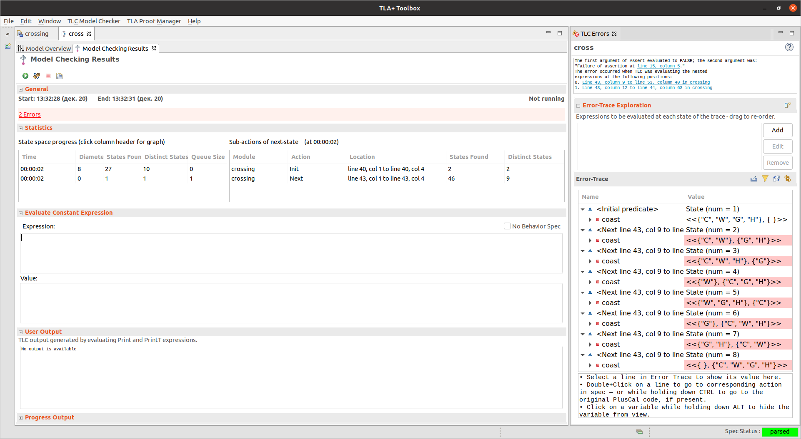

# **Задача о переправе**

Найти с помощью TLA+ решение [задачи о волке, козе и капусте](https://ru.wikipedia.org/wiki/%D0%92%D0%BE%D0%BB%D0%BA,_%D0%BA%D0%BE%D0%B7%D0%B0_%D0%B8_%D0%BA%D0%B0%D0%BF%D1%83%D1%81%D1%82%D0%B0). [Информация о синтаксисе и возможностях TLA+](https://learntla.com/tla/).

TLA+ интегрируется с доказателями теорем. Его можно использовать для доказательства свойств алгоритмов.

Нам будет более интересен TLA+ Model Checker, который производит поиск по пространству состояний системы и может находить кратчайшую последовательность действий, приводящую к нарушению заданных инвариантов.

.